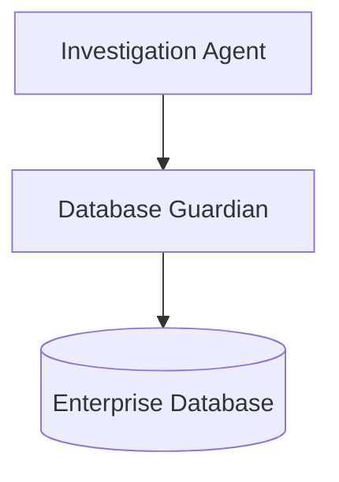
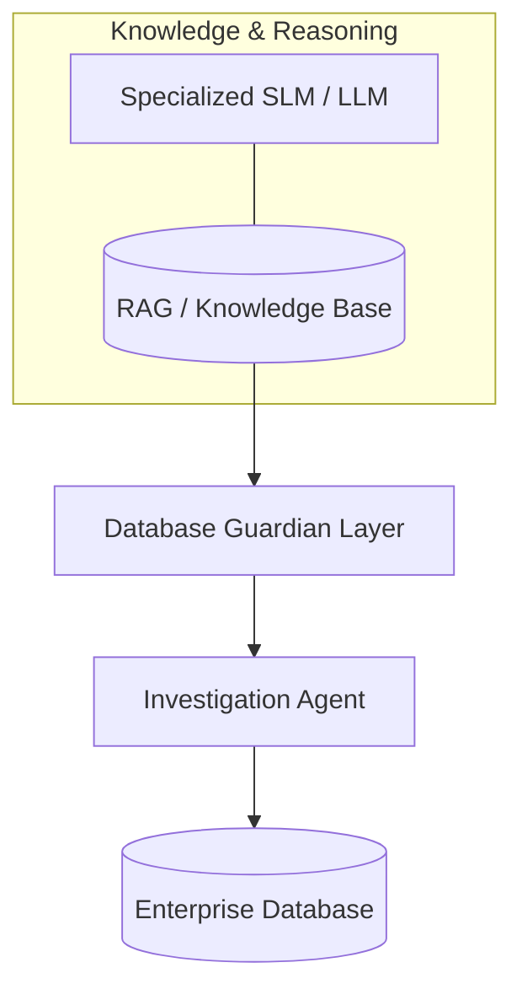

# Database Guardians

Experimental governance and knowledge layer for AI agents investigating enterprise databases.

## 1. Problem Statement

Autonomous AI agents tasked with investigating enterprise databases typically generate ad-hoc exploratory queries to discover schema relationships and data distributions. In production environments, this unconstrained exploration introduces critical engineering challenges:

- Excessive resource consumption and unnecessary database load;
- Redundant re-discovery of structures, views, and indexes already defined in the catalog;
- Risk of ignoring existing stored procedures, triggers, and codified business logic;
- Potential lock contention and performance degradation on transactional workloads.

Database Guardians investigates whether providing an agent with prior, structured domain knowledge mitigates these issues compared to unconstrained exploration.

## 2. Concept

The **Database Guardian** is an upstream knowledge and governance layer. It is consulted before or during an investigation to supply context regarding:

- Schema topology, primary/foreign keys, and indexes;
- Business rules and accounting/financial conventions;
- Pre-existing procedures, functions, and materialized views;
- Dependency graphs and controlled operational metadata.

## 3. Architecture

### Core Conceptual Model

### Potential Implementation Pipeline

*Note: SLMs, RAG, and World Models are candidate implementation technologies; they do not define the architectural role of the Guardian.*

## 4. Research Foundations

The project was motivated by and builds upon the following literature:

1. **D² (Multi-Agent Data Investigation):**  
   Fabian Wenz, Zixuan Chen, Carsten Binnig. *From Data Querying to Data Investigations: Rethinking Natural Language Interfaces for Databases*. [arXiv:2609.03898](https://arxiv.org/abs/2609.03898).
2. **Continual Discovery Agent (CDA):**  
   Shambhavi Mishra et al. *Continual Enterprise World Model Discovery in Dynamic Systems*. [arXiv:2609.19551](https://arxiv.org/abs/2609.19551).
3. **Small Language Models:**  
   Infosys Knowledge Institute. *Small Language Models for Financial Services*.

*Detailed analysis and intellectual lineage are documented in [`docs/Database_Guardians_Projeto.md`](docs/Database_Guardians_Projeto.md).*

## 5. Methodological Framework

To maintain scientific and technical rigor, this project strictly separates:

- **Literature Findings:** Established conclusions from published papers;
- **Proposal:** The architectural role of the Database Guardian;
- **Hypothesis:** Assumptions to be empirically tested (e.g., reduction in query volume and token cost);
- **Implementation:** Working prototypes and environments actually constructed;
- **Evidence:** Quantitative benchmark results and verified measurements.

## 6. Current Status

| Dimension | Status |
| :--- | :--- |
| **Concept** | Defined |
| **Architecture** | Initial specification defined |
| **Prototype** | Not implemented |
| **Benchmark** | Not defined |
| **Academic Integration (MBA TCC)** | Potential research direction |

## 7. Roadmap

1. **Synthetic Financial Database:** Design a controlled relational schema with realistic financial transactions, constraints, and business logic.
2. **Controlled Discrepancy Scenarios:** Inject documented, deterministic reconciliation anomalies (Ground Truth).
3. **Guardian Knowledge Model:** Formalize metadata extraction and domain representation.
4. **Baseline Investigator (Architecture A):** Implement standard agent performing direct SQL exploration.
5. **Guardian-Assisted Investigator (Architecture B):** Implement investigator guided by the knowledge layer.
6. **Controlled Benchmarking:** Measure total queries, spurious queries, token consumption, execution latency, and root-cause accuracy.
7. **Analysis & Documentation:** Report findings, boundary conditions, and failure modes.
